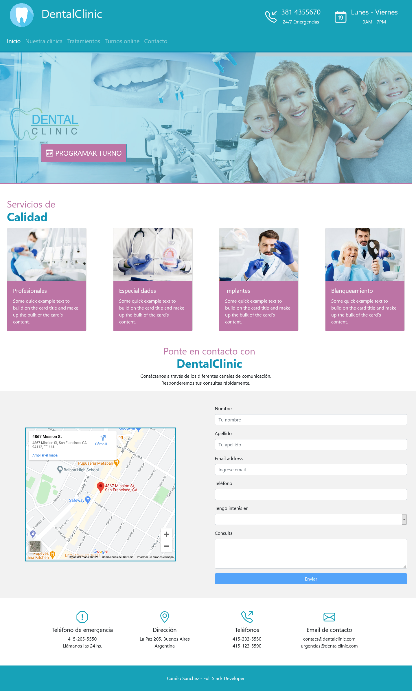
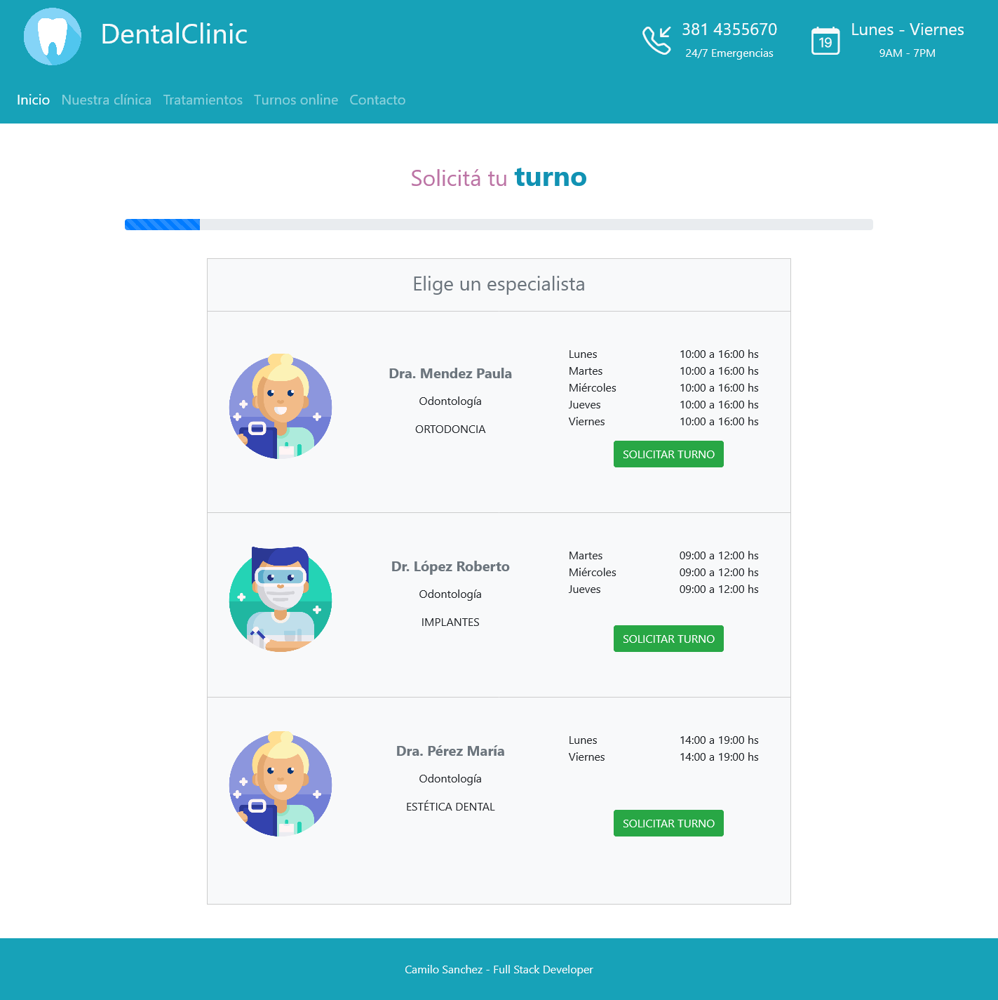
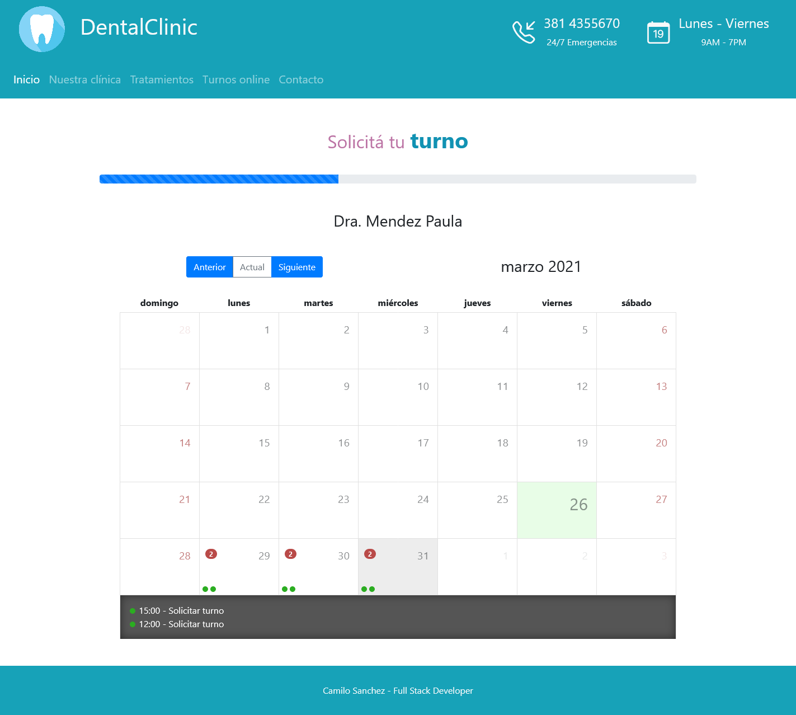
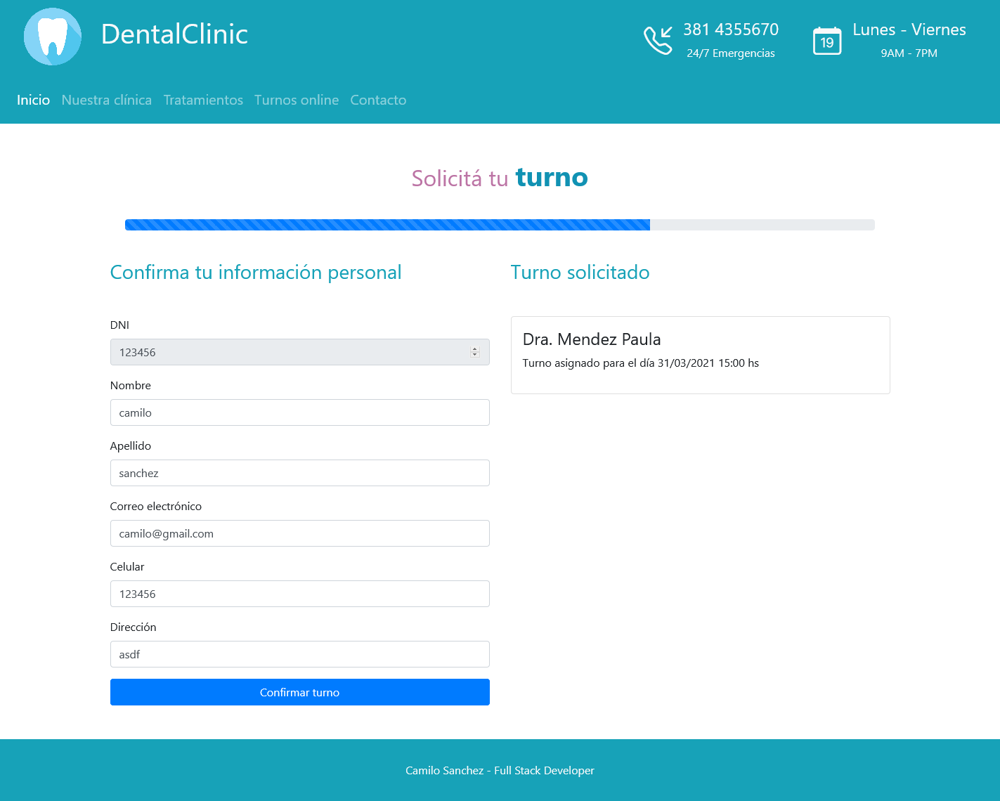

# DentalClinic
DentalClinic - ASP .NET CORE, Angular 10, PostgresSQL 11.
## Proyecto
Sistema creado para proyecto de clínica dental. 
Landing page con encabezado, menú de páginas, presentación, mapa y formulario de contacto. 
Página "Nuestra clínica" con información de la institución. 
Página "Tratamientos" con los servicios ofrecidos por la clínica dental. 
Página "Turnos" para solicitar turno de atención. 

### Sistema de turnos
Permite a los usuarios seleccionar especialista con diferentes horarios y días de atención. 
El usuario puede elegir el día y horario en el calendario. 
Se solicita al usuario el número de DNI.  
- En caso de ser usuario registrado aparecerán sus datos para confirmación.
- En caso de no ser usuario registrado deberá completar el formulario de inscripción.
 
Una vez confirmada la información del usuario, se completará la asignación del turno. 
El usuario tiene la posibilidad de cambiar el horario y día del turno o cancelarlo. 
Cada turno ocupado desaparecerá del Calendario de turnos disponibles.
 

### Demo

Demo | <a href="https://dentalclinicweb.azurewebsites.net/">DentalClinic on Azure</a>
 
### Screenshots

